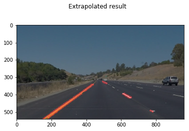
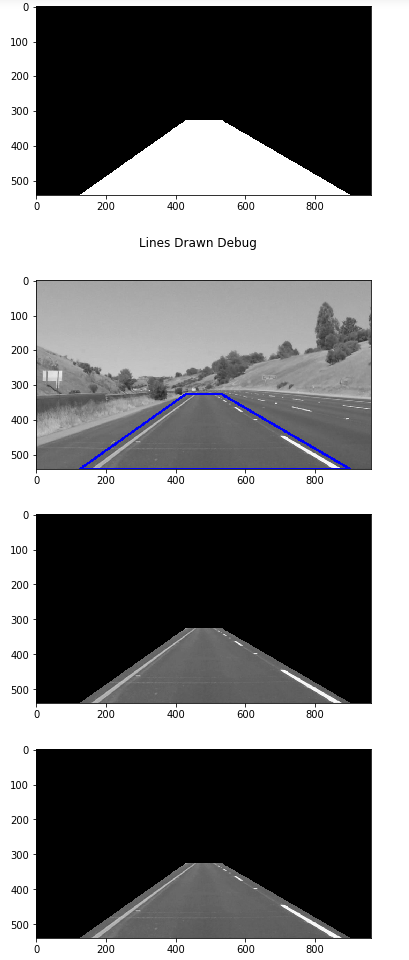
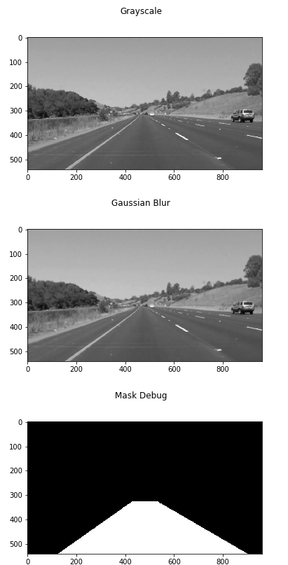
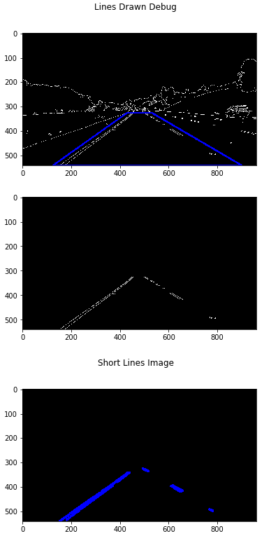
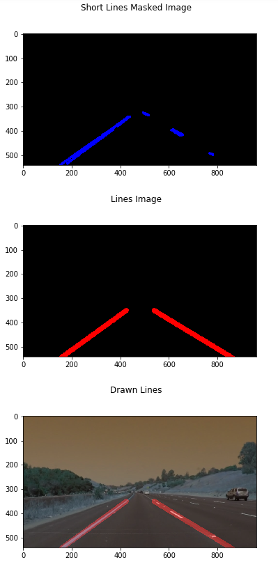

# **Finding Lane Lines on the Road** 

Udactiy Self Driving Car Nanodegree Project 1

## Brief
This is my entry for the self driving car nanodegree's 1st project - Lane Finding. It uses manual computer vision techniques for lane identification. In this write up I'll be writing how the code works, issues I encountered during development, existing bugs, and general thoughts on the project.

## Notes on project
This project is a Jupyter Notebook, whose output is browseable on github. Some functionality, however, is not shown via the output and would require either reading this or exploring the code on your own to see. (Such as the partition test functionality, or the hough_lines pipeline to be explained).

## A Note on Colorspaces
Throughout this project, outputs may look slightly "off" - or, you may see optional parameters used in my functions to define a _colorType_. This is due to loading the images using different functions to load frame - `cv.imread`, `matplotlib.image.imread`, and whatever functionality used by `moviepy.editor`'s `VideoFileClip`.

OpenCV and, as a result, `cv.imread` uses BGR color spacing where as others use and expect RGB imaging. This means that `plt.imshow()` on OpenCV read images will look off as the blue and red channels are switched. This also means that extrapolated lines will be red in a video file, but blue in an OpenCV read image.

## Pipeline
I had three "pipelines" for output. While not directly linked to one another, each essentially acted as a predecessor to the other (as written) and followed the path of development followed.

* pipeline_hough - This pipeline would only follow image preparation to the stage of getting all Hough lines and then returning the image marked with Hough lines

* pipeline - The "standard" pipeline - it would pick up where the Hough pipline would let off. It'd take the Hough lines and extrapolate a lane line for left and right, and then draw them on the given frame

* pipeline_with_memory - This pipeline was built specifically for video - the idea was to introduce some kind of memory mechanism into the pipeline so that extrapolated lane lines would be "smoothed" frame to frame during a video sequence. This will be explained later.

### Parameters
All pipelines had the following parameters

* image - This is the frame of the image, assumed to be a three channel image in a two dimensional array
* colorType - defaults to RGB, defines the color range that we are working with. BGR is the other option (see A Note on Colorspaces above)
* debug - defaults to False. Throughout the pipeline and helper functions, I have several plots be created as the process progresses to allow easier debugging and seeing what various attributes do when fine tuning the computer vision code. Future discussion of how the pipelines work shall utilize this debug method to illustrate the process.

### The Process

The process can be divided into several large steps, further subdivided into smaller steps that would just be a few numpy/opencv api calls. The below images walks through the entirety of the process for a given frame, whereas here I shall give a high level overview of each process.

#### prepare_image

`prepare_image` accepts an image and returns an image that has been:
1. "Gray" the image by converting it from BGR/RGB to grayscale
1. Blur the image via Gaussian blur.

There were some additional attempts at expanding image preparation, but were abandoned due to time constraints and that it actually lowered success rates of what I already had. This process would have looked like:
1. "Gray" the image
1. Create a "darker" copy of the gray image, to be used later
1. From the original RGB copy of the image (converted if it was BGR) create a white mask where we isolate only values that match a certain threshold of "white"
1. Create a similar mask, but looking for the color yellow
1. Combine said masks into a combined mask
1. Uses these masks to overlay onto the darker gray image the lighter gray image, but only where white and yellow was determined to be. This creates a far strong difference between these pixels and their background, creating a stronger gradient and more detectable lines
1. Blur the image via Gaussian blur

### get_edges
This function would get the edges of an image by running opencv's Canny edge detection algorithm on an image.

### Partition

The partition function, shown below, would select a given area and cut away the rest of the image. This has to be done after detecting edges, as the sharpest edge detected would be the partition itself.

### Get the Hough Lines
Using opencv's  Progressive Probabilistic Hough Transform Function - `cv2.HoughLinesP`. I first used the documentation's suggested parameters, but found more success with standard paremeters we experimented and discovered prior in class. The values had immediate results so I did not play with them much.

Here the `pipeline_hough` function would end, mask the lines over the original image, and be done. The other pipelines continued.

### Extrapolate lane lines

`extrapolate_lane_lines` would, given a list of hough lines, do the following:

1. Create a list of all points as tuples (x, y).
    1. These lines would be divided between "left lane" and "right lane" by checking their x value's against the midway mark in the image size - this seemed like the easiest way to do this.
1. For each left and right, call the `extrapolate_line` for each set of points.
1. `extrapolate_line` would, for each set of points:
    1. Use numpy's `np.polyfit` to generate a first degree polynomial (y=mx+b) for the given points
    2. Calculate two points to draw our extrapolated lines:
        1. For the bottom most point, using the height of our image (minus 1 for zero indexing), calculate the resultant X.
        2. For a given predefined "max height" (350px for this setup), calculate the intercept point's given X

### Draw extrapolated lines
Once we have the lines, draw them over the original frame image using opencv's `cv2.addWeighted` which allows us to layer images with some control over transparency.

## The whole process
Below is a series of images screenshotted with the `debug=True` flag set, showing each stage in the pipeline.

## Video and memory

In order to make the lines smoother for video, I decided to give the processing pipeline have a "memory" to be prevent frame by frame jitteriness in the video. I tried two methods and settled on one.

### Percentage change

My first method I tried was setting a `max_slope_change_percentage` and a `max_intercept_change_percentage` which would limit the change of the slope/intercept in the extrapolated line to a given percentage from the prior frame's line. The idea here is that larger frame by frame changes would be mitigrated to a maximum change from the prior lines - leading to smoother overall movement.

Jitteriness still appeared, but worse, it actually seemed to worsen the results of several output videos. I eventually abandoned it when I found success with the next method.

### Averaging a given second

Estimating the frame rate of the video at 24 fps, I created an array of at most the 24 most recent extrapolated lane lines from the prior frames. Each frame would take into account all of these (save the first frame) and average the `np.polyfit` slope and intercepts together. This resulted in a far smoother change of lane lines over travel time.

In order to do this, you can see that most pipeline and lane extrapolaton functions support passing in a `previous_history` attribute, which would be our array of previously calculated slope and intercepts. If the `previous_history` attribute is passed, it would utilize the averaging technique - otherwise it would ignore it and handle it as a standalone frame.

## Challenge Submission

Unfortunately, due to time contraints, I was not able to get my methods working. I suspect they did not work entirely due to
1. The hood of the car being visible. This would be easy to remove in a separate partitionin function
2. Slightly darker shades - changing the threshold attributes would make this easier to spot.

## Potential Problems and Improvements to the Pipeline

This pipeline has several issues - it is entirely too manual. A cloudy day will entirely change required thresholding values. A steep hill would dramatically change the field of view the partition function would need to detect. Close traffic would do the same. Night time would signifcantly reduce the gradient difference in lane lines as well. A sharp turn would also significantly freak out the 1st order polynomial I used for the lane extrapolation.

Automating much of the "magic number" selection would be required, and that means training AI. In the past, I have success with other robotic and hardware build projects that were placed outdoors by using cameras with infrared filters removed in order to detect humans easier against background images - I suspect the bright lane lines would be similarly detected easier - or perhaps an entirely different filter for the cameras.

For issues where a car is too close to detect too many lane lines, merely orienting your center to that car's center may be sufficient as well.
